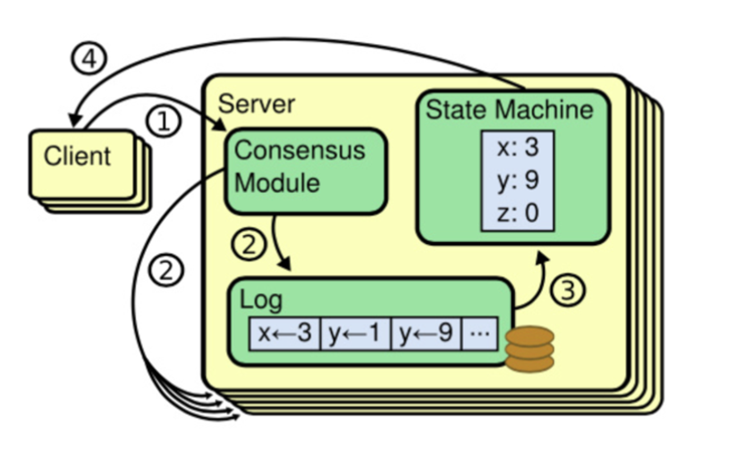
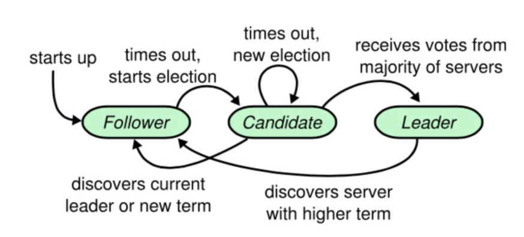
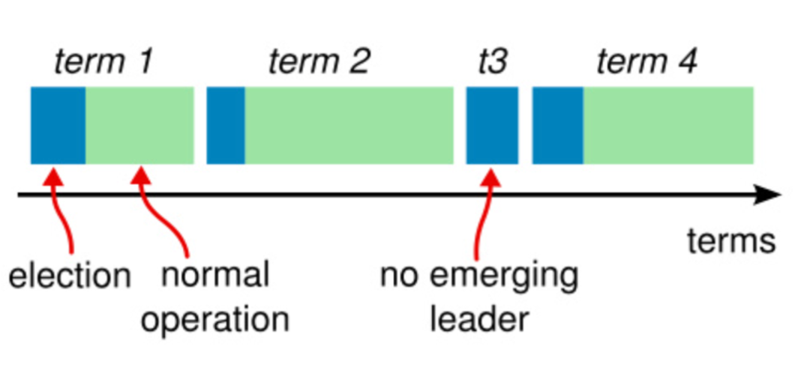
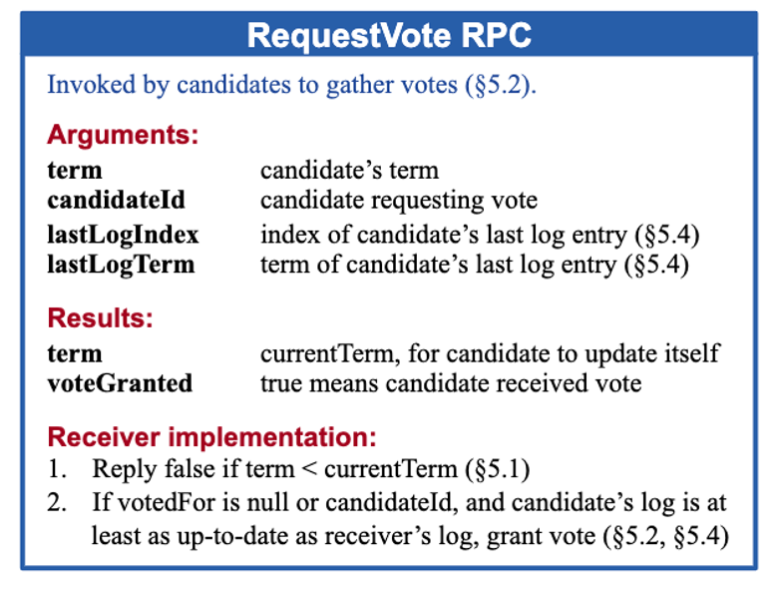
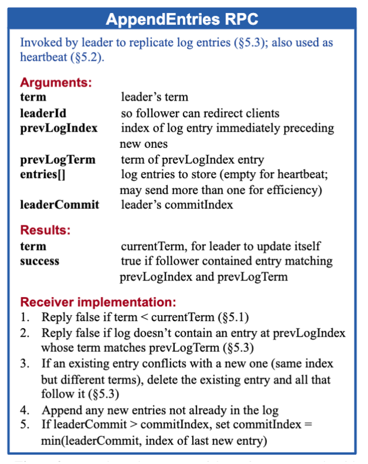
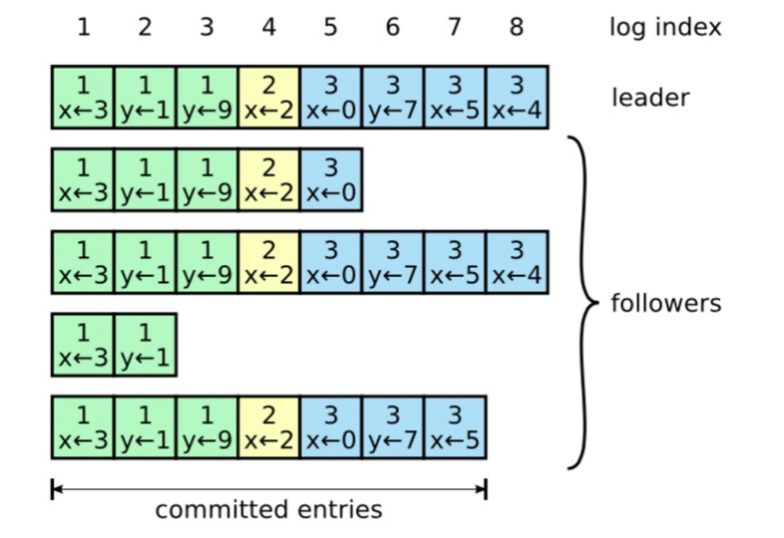
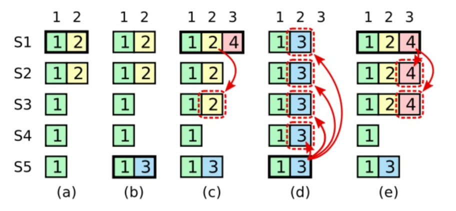

# raft 是共识算法，那么什么是共识

## 一致性问题

一致性问题是分布式领域最基础、最重要的问题，也是半个世纪以来的研究热点。 随着业务场景越来越复杂，计算规模越来越庞大，单点系统往往难以满足高可扩展（Scalability）和高容错（Fault-tolerance）两方面的需求。此时就需要多台服务器通过组成集群，构建更加强大和稳定的“虚拟超级服务器”。

任务量越大，处理集群的规模越大，设计和管理的挑战也就越高。谷歌公司的全球搜索集群系统，包括数十万台服务器，每天响应百亿次的互联网搜索请求。 集群系统要实现一致性不是一件容易的事。不同节点可能处于不同的状态，不同时刻收到不同的请求，而且随时可能有节点出现故障。

一致性（Consistency），在分布式系统领域中是指对于多个服务节点，给定一系列操作，在约定协议的保障下，使得它们对处理结果达成“某种程度”的协同。

那么，为什么说一致性问题十分重要呢？

举个现实生活中的例子，多个售票处同时出售某线路上的火车票，该线路上存在多个经停站，怎么才能保证在任意区间都不会出现超售（同一个座位卖给两个人）的情况？

## 共识

共识（Consensus）这个术语很多时候会与一致性（Consistency）术语放在一起讨论。严谨地讲，两者的含义并不完全相同。

一致性的含义比共识宽泛，在不同场景（基于事务的数据库、分布式系统等）下意义不同。具体到分布式系统场景下，一致性指的是多个副本对外呈现的状态。如前面提到的顺序一致性、线性一致性，描述了多节点对数据状态的共同维护能力。而共识，则特指在分布式系统中多个节点之间对某个事情（例如多个事务请求，先执行谁？）达成一致看法的过程。因此，达成某种共识并不意味着就保障了一致性。

实践中，要保障系统满足不同程度的一致性，往往需要通过共识算法来达成。

共识算法解决的是分布式系统对某个提案（Proposal），大部分节点达成一致意见的过程。提案的含义在分布式系统中十分宽泛，如多个事件发生的顺序、某个键对应的值、谁是主节点……等等。可以认为任何可以达成一致的信息都是一个提案。

## CAP 原理

CAP 原理最早出现在 2000 年，由加州大学伯克利分校的 Eric Brewer 教授在 ACM 组织的 Principles of Distributed Computing（PODC）研讨会上提出的猜想。两年后，麻省理工学院的 Nancy Lynch 等学者进行了理论证明。 该原理被认为是分布式系统领域的重要原理之一，深刻影响了分布式计算与系统设计的发展。

**CAP 原理**：分布式系统无法同时确保**一致性（Consistency）**、**可用性（Availability）**和**分区容忍性（Partition）**，设计中往往需要弱化对某个特性的需求。

**一致性**：任何事务应该都是原子的，所有副本上的状态都是事务成功提交后的结果，并保持强一致；

**可用性**：系统（非失败节点）能在有限时间内完成对操作请求的应答；

**分区容忍性**：系统中的网络可能发生分区故障（成为多个子网，甚至出现节点上线和下线），即节点之间的通信无法保障。而网络故障不应该影响到系统正常服务。

CAP 原理认为，分布式系统最多只能保证三项特性中的两项特性。既然 CAP 三种特性不可同时得到保障，则设计系统时候必然要弱化对某个特性的支持。

**弱化一致性**：对结果一致性不敏感的应用，可以允许在新版本上线后过一段时间才最终更新成功，期间不保证一致性。例如网站静态页面内容、实时性较弱的查询类数据库等

**弱化可用性**：对结果一致性很敏感的应用，例如银行取款机，当系统故障时候会拒绝服务。MongoDB、Redis、MapReduce 等为此设计。**Paxos、Raft 等共识算法，主要处理这种情况。**

# 复制状态机

复制状态机, 是分布式数据库领域最重要的基石之一. 当前市面上所有实用的分布式数据库, 几乎都是用日志复制状态机技术来实现多副本. 像 MySQL 的主从同步, Redis 的主从同步等。

下图是由 raft 提出的复制状态机的结构。 server 内部分 3 大模块，consensus module，log 和 state machine。由 consensus module 管理日志，而 state machine 从日志中处理相同顺序的指令。

状态机基于一个定理，如果两个对象被称作状态机，它们按相同的顺序 apply 相同的指令，那么这两个复制状态机的最终状态必然是一致的。所以共识算法的任务就是保持日志的一致性，保证每一个服务器的状态机以相同的日志顺序处理它们。


# Raft 基础

raft 算法的特性总结：

1. 选举安全特性：对于一个给定的任期号，最多只有一个 leader
2. leader 只附加原则：leader 绝对不会删除或者覆盖自己的日志，只会增加
3. 日志匹配原则：如果两个日志在某一相同索引位置日志条目的任期号完全相同，那么就认为这两个日志从头到该索引位置之间的内容完全一致
4. leader 完全特性：如果某个日志条目在某个任期号已经被提交，那么这个条目必然出现在更大任期号的所有 leader 中
5. 状态机安全特性：如果某一服务器已将给定索引位置的日志条目应用至状态机中，则其他任何服务器在该索引位置不会应用不同的日志条目

在任何时刻，任一节点都处于这 3 个状态之一：follower，candidate 和 leader。在同一网络分区中，系统中只有唯一的 1 个 leader。

**follower：**只是被动处理请求，不会发送任何请求，负责响应来自 leader 和 candidate 的请求。

**leader：**raft 采用 strong leader 形式，日志仅从 leader 流向其他节点，简化了复制日志的管理。由 leader 处理所有来自客户端的请求，如果客户端和 follower 联系了，就会将请求重定向给 leader。

**candidate：**如果 follower 在选举时间结束后，依然没有接收到来自 leader 的请求，他会认为 leader 已经宕机了。这时候当前的集群中需要有一个新的 leader，所以它会变成 candidate 并发起一次选举。如果在选举中，获得大多数选票则会成为 leader。


raft 把时间分割成一个个的任期，任期用连续的整数标记。每个任期始于一次选举。如果有节点选举成功，则它会成为领导人并管理整个集群直到该任期结束。如果选票被瓜分导致都选举失败，没有节点成为 leader 则会直接结束并很快开始下一次选举开启新的任期。

任期在 raft 算法中充当时钟的作用，使得服务器可以检测出过期的信息。每个节点存储一个当前任期号，这一编号在整个时期内单调递增。每当服务器之间通信都会交换当前任期号

1. 如果一个服务器的当前任期号比其他人小，则会更新自己的任期号到较大的任期号。
2. 如果一个 leader 或者 candidate 发现自己的任期号过期了，那么他会立即恢复成 follower 状态。
3. 如果一个服务器接收到一个包含过期任期号的请求，则会直接拒绝该请求。


# 服务器之间的通信

raft 算法中服务器节点之间通信使用 RPC，基本的共识算法中只需要 2 种 RPC。

1. Request Vote RPC (请求选票)： 由 candidate 发起，用来选举时为自己拉票。
2. Append Entries RPC (添加日志)：由 leader 发起，作为一种心跳检测机制和用于复制日志给其他节点。



后面再展开这部分的 RPC 实现细节。

**raft 算法中的两大重点：**

1. leader 选举
2. 主从复制和安全性

# leader 选举

当服务器程序启动时都初始化为 follower。如果接收到来自其他服务器的请求则会保持为 follower。leader 会定期的发送 Append Entries RPC 作为心跳检测包以保持自己的权威。如果一个 follower 在选举时间内没有收到任何消息，则会认为当前系统中没有 leader 而转变成 candidate 发起选举为自己拉票。

## 选举过程

开始一次选举时 follower 会增加自己的任期号并转化为 canditate，然后并行地向集群中的其他服务器节点发送 Request Vote RPC 来为自己拉票。

在 raft 中的选举中大家是非常和平的，candidate 的目标并不是不惜一切代价让自己赢得选举（cue 一下川普同志），所有 candidate 的目标是让合适的节点成为 leader，如果集群中已经存在了合适的人成为 leader，则会主动放弃选举成为 follower。

1. **选举成功：**当一个 candidate 获得了整个集群中的大多数（N/ 2 + 1）选票，则会成为 leader。要求获得大多数选票才能成为 leader 的规则确保了最多只能有 1 个 candidate 成功赢得选举。一旦 candidate 赢得选举，就会立即成为 leader 并向其他的服务发送心跳检测包来建立自己的权威并阻止发生新的选举。
2. **选举失败**：如果集群中已经选举出其他 leader，则选举失败。 在 candidate 等待选票时，如果收到了来自 leader 的 Append Entries RPC 请求，且这个请求的任期号参数不小于 candidate 的当前任期号则会承认这个 leader 的合法并成为 follower。如果请求的任期号参数小于自己的当前任期号则会拒绝该 rpc并继续自己的选举。
3. **选举不成功也不失败，选票被瓜分**：如果有多个 follower 同时成为 candidate，那么选票可能会被瓜分，以至于没有 candidate 能赢得大多数人的支持。这种情况下，每一个 candidate 都会选举超时，然后通过增加任期号以开始新一轮选举。其实这种情况下，如果彼此的 candidate 超时时间相同，意味着选票可能会被一直瓜分，集群中始终无法选举出新的 leader。所以 raft 算法使用随机超时时间来把服务器分散开来，使大多数情况下不会出现多个 follower 同时选举超时的情况，减少选票被瓜分的发生概率，即使发生了，也能被快速解决。

下面算选举的代码实现

## 1. consensus module

consensus module 是 raft 算法实现中的核心内容，位于 `raft.go` 文件中

首先定义 consensus module 的结构体如下

每个节点都有自己的 id 标识，集群中的每个节点将其他节点称为 peer，将集群中的其他所有节点存在 peerIds 数组中。

```go
type ConsensusModule struct {
	mu sync.Mutex

	id      int
	peerIds []int
	server  *Server

	currentTerm       int
	votedFor          int
	state             CMState
	electionResetTime time.Time
}
```

## 2. election timer

**实现一个随机超时时间生成函数**

选举超时时间在 `[ElectionTimeoutMin，ElectionTimeoutMax]`范围内

```go
func (cm *ConsensusModule) electionTimeout() time.Duration {
	return time.Duration(rand.Intn(ElectionTimeoutMax-ElectionTimeoutMin)+ElectionTimeoutMin) * TimeoutUnit
}
```

**实现选举计时器**

1. 调用 `electionTimeout()` 随机生成一个选举超时时间
2. 如果从更高任期的领导者收到了 Request Vote RPC 则会成为更新任期并启动新的选举计时器，所以当任期与当前任期不相同时则 return，用以回收旧任期时的选举计时器
3. 在选举超时时间内没有收到任何请求，则开始选举

```go
func (cm *ConsensusModule) runElectionTimer() {
	electionTimeout := cm.electionTimeout()
	cm.mu.Lock()
	termStarted := cm.currentTerm
	cm.mu.Unlock()
	cm.debug("election timer started (%v), term (%d)", electionTimeout, termStarted)

	ticker := time.NewTicker(10 * time.Millisecond)
	defer ticker.Stop()
	for {
		<-ticker.C

		cm.mu.Lock()
		if !cm.isFollower() && !cm.isCandidate() {
			cm.debug("in election timer state=%s, bailing out", cm.state)
			cm.mu.Unlock()
			return
		}

		if cm.currentTerm != termStarted {
			cm.debug("in election timer term changed from %d to %d, bailing out", termStarted, cm.currentTerm)
			cm.mu.Unlock()
			return
		}

		if elapsed := time.Since(cm.electionResetTime); elapsed >= electionTimeout {
			cm.startElection()
			cm.mu.Unlock()
			return
		}
		cm.mu.Unlock()
	}
}
```

## 3. start election

1. 调用 `startElection()` 前 cm.mu 是已经上了🔐的
2. 选举开始前将当前任期 +1 ，并将状态转化为 candidate
3. 默认带上自己为自己的选票，当前选票数初始为 1
4. 并行的发送 Request Vote RPC 向集群中的其他节点拉票
    1. 选举过程中已经不是 candidate 了，则不再处理后续的 RPC 响应
    2. RPC 响应结果的任期号比自己当前任期号更高，则成为 follower 且不再处理后续的 RPC 响应
    3. 获得大多数选票时（选票数 > (N / 2) + 1），成为 leader
5. 开始选举后异步调用 `runElectionTimer()` 启动新的选举计时器，确保如果这次选举中选票被瓜分，会在选举计时器超时后继续开始新的一轮选举

```go
func (cm *ConsensusModule) startElection() {
	cm.state = Candidate
	cm.currentTerm += 1
	preCurrentTerm := cm.currentTerm
	cm.votedFor = cm.id
	cm.electionResetTime = time.Now()
	cm.debug("becomes Candidate (currentTerm=%d)", cm.currentTerm)

	votesReceived := 1

	args := RequestVoteArgs{
		Term:        preCurrentTerm,
		CandidateId: cm.id,
	}
	for _, peerId := range cm.peerIds {
		go func(peerId int) {
			var reply RequestVoteReply
			cm.log("sending RequestVote to %d: %+v", peerId, args)
			err := cm.server.Call(peerId, "ConsensusModule.RequestVote", args, &reply)
			if err == nil {
				cm.mu.Lock()
				defer cm.mu.Unlock()
				cm.log("received RequestVoteReply %+v", reply)
				if !cm.isCandidate() {
					cm.log("while waiting for reply, state = %s", cm.state)
					return
				}
				if reply.Term > preCurrentTerm {
					cm.log("term out of date in RequestVoteReply")
					cm.becomeFollower(reply.Term)
					return
				}
				if reply.Term == preCurrentTerm && reply.VoteGranted {
					votesReceived += 1
					if votesReceived*2 > len(cm.peerIds)+1 {
						cm.log("wins election with %d votes", votesReceived)
						cm.startLeader()
						return
					}
				}
			}
		}(peerId)
	}

	go cm.runElectionTimer()
}
```

## 4. become leader

**开始 leader 任期**

1. 状态转变为 leader
2. 定期发送心跳包

```go
func (cm *ConsensusModule) NewHeartbeatTicker() *time.Ticker {
   return time.NewTicker(HeartbeatTimeout * TimeoutUnit)
}

func (cm *ConsensusModule) startLeader() {
	cm.debug("becomes Leader (currentTerm=%d)", cm.currentTerm)
	cm.state = Leader

	go func() {
		ticker := cm.NewHeartbeatTicker()
		defer ticker.Stop()

		for {
			cm.leaderHeartbeats()
			<-ticker.C

			cm.mu.Lock()
			if !cm.isLeader() {
				cm.mu.Unlock()
				return
			}
			cm.mu.Unlock()
		}
	}()
}
```

**实现心跳包发送**

1. 逻辑类似前面的 `startElection()` ,只是发送的 RPC 不同，是 AppendEntries
2. 如果收到的 RPC 响应的任期号比自己的更大，则成为 follower

```go
func (cm *ConsensusModule) leaderHeartbeats() {
	cm.mu.Lock()
	if !cm.isLeader() {
		cm.mu.Unlock()
		return
	}
	savedCurrentTerm := cm.currentTerm
	cm.mu.Unlock()

	args := AppendEntriesArgs{
		Term:     savedCurrentTerm,
		LeaderId: cm.id,
	}
	for _, peerId := range cm.peerIds {
		go func(peerId int) {
			var reply AppendEntriesReply
			cm.debug("sending AppendEntries to %d: %+v", peerId, args)
			err := cm.server.Call(peerId, "ConsensusModule.AppendEntries", args, &reply)
			if err == nil {
				cm.mu.Lock()
				defer cm.mu.Unlock()
				cm.debug("received AppendEntriesReply %+v", reply)
				if !cm.isLeader() {
					cm.log("while waiting for reply, state = %s", cm.state)
					return
				}
				if reply.Term > savedCurrentTerm {
					cm.debug("term out of date in AppendEntriesReply")
					cm.becomeFollower(reply.Term)
					return
				}
			}
		}(peerId)
	}
}
```

## 5. become follower

成为 follower 的逻辑非常简单，因为 follower 期间不会发起 RPC 请求，只负责响应 RPC 请求。

1. 初始化投票对象为 -1，更新任期号并将成为 follower
2. 异步调用 `runElectionTimer()` 启动新的选举计时器

```go
func (cm *ConsensusModule) becomeFollower(term int) {    cm.log("becomes Follower term=(%d)", term)    cm.state = Follower    cm.currentTerm = term    cm.votedFor = -1    cm.electionResetTime = time.Now()    go cm.runElectionTimer()}
```

## 6. RPC

**实现 RPC 代理**

```go
type RPCProxy struct {
	cm *ConsensusModule
}

type RequestVoteArgs struct {
	Term         int
	CandidateId  int
	LastLogIndex int
	LastLogTerm  int
}

type RequestVoteReply struct {
	Term        int
	VoteGranted bool
}

func (p *RPCProxy) RequestVote(args RequestVoteArgs, reply *RequestVoteReply) error {
	f := rand.Float32()
	// 模拟 rpc 请求失败
	if f < MockUnreliableRpcFailureRate {
		p.cm.debug("drop RequestVote")
		time.Sleep(time.Duration(MockUnreliableRpcFailureDuration) * TimeoutUnit)
		return fmt.Errorf("RPC failed")
	}
	// 模拟网络延迟
	if f < MockUnreliableRpcDelayRate {
		p.cm.debug("delay RequestVote")
		time.Sleep(time.Duration(MockUnreliableRpcDelayMin+rand.Intn(MockUnreliableRpcDelayMax-MockUnreliableRpcDelayMin)) * TimeoutUnit)
	} else {
		time.Sleep(time.Duration(MockUnreliableRpcLatencyMin+rand.Intn(MockUnreliableRpcLatencyMax-MockUnreliableRpcLatencyMin)) * TimeoutUnit)
	}

	return p.cm.RequestVote(args, reply)
}

type AppendEntriesArgs struct {
	Term         int
	LeaderId     int
	PrevLogIndex int
	PrevLogTerm  int
	Entries      []LogEntry
	LeaderCommit int
}

type AppendEntriesReply struct {
	Term          int
	Success       bool
	ConflictIndex int
	ConflictTerm  int
}

func (p *RPCProxy) AppendEntries(args AppendEntriesArgs, reply *AppendEntriesReply) error {
	f := rand.Float32()
	// 模拟 rpc 请求失败
	if f < MockUnreliableRpcFailureRate {
		p.cm.debug("drop RequestVote")
		time.Sleep(time.Duration(MockUnreliableRpcFailureDuration) * TimeoutUnit)
		return fmt.Errorf("RPC failed")
	}
	// 模拟网络延迟
	if f < MockUnreliableRpcDelayRate {
		p.cm.debug("delay RequestVote")
		time.Sleep(time.Duration(MockUnreliableRpcDelayMin+rand.Intn(MockUnreliableRpcDelayMax-MockUnreliableRpcDelayMin)) * TimeoutUnit)
	} else {
		time.Sleep(time.Duration(MockUnreliableRpcLatencyMin+rand.Intn(MockUnreliableRpcLatencyMax-MockUnreliableRpcLatencyMin)) * TimeoutUnit)
	}
	return p.cm.AppendEntries(args, reply)
}
```

**实现 RequestVote RPC**

1. 如果自己当前的任期过期，则成为跟随者
2. 如果 RPC 请求的任期号相同，且自己还没有投票给其他节点，则批准投票

```go
func (cm *ConsensusModule) RequestVote(args RequestVoteArgs, reply *RequestVoteReply) error {
	cm.mu.Lock()
	defer cm.mu.Unlock()

	if cm.state == Dead {
		return nil
	}

	cm.debug("RequestVote: %+v [currentTerm=%d, votedFor=%d]", args, cm.currentTerm, cm.votedFor)

	if args.Term > cm.currentTerm {
		cm.log("... term out of date in RequestVote")
		cm.becomeFollower(args.Term)
	}

	if cm.currentTerm == args.Term && (cm.votedFor == -1 || cm.votedFor == args.CandidateId) {
		reply.VoteGranted = true
		cm.votedFor = args.CandidateId
		cm.electionResetTime = time.Now()
	} else {
		reply.VoteGranted = false
	}
	reply.Term = cm.currentTerm
	cm.debug("... RequestVote reply: %+v", reply)
	return nil
}
```

**实现 Append Entries RPC**

逻辑与 RequestVote 基本一致，除了以下代码，这个实现是日志主从复制前的方案，以保证同一集群的任意时刻只能有一个 leader

```go
if cm.state != Follower {
			cm.becomeFollower(args.Term)
		}
```

```go
func (cm *ConsensusModule) AppendEntries(args AppendEntriesArgs, reply *AppendEntriesReply) error {
	cm.mu.Lock()
	defer cm.mu.Unlock()

	if cm.state == Dead {
		return nil
	}
	cm.debug("AppendEntries: %+v [currentTerm=%d]", args, cm.currentTerm)

	if args.Term > cm.currentTerm {
		cm.debug("... term out of date in AppendEntries")
		cm.becomeFollower(args.Term)
	}

	reply.Success = false
	if args.Term == cm.currentTerm {
		if cm.state != Follower {
			cm.becomeFollower(args.Term)
		}
		cm.electionResetTime = time.Now()
		reply.Success = true
	}
	reply.Term = cm.currentTerm
	cm.debug("... AppendEntries reply: %+v", reply)
	return nil
}
```

但如果引入了日志主从复制，显然这里就不合理了，因为这很可能让恢复脑裂时，一个应该继续当 leader 的成为了 follower，导致集群暂时失去了 leader。

比如：ABC 三台主机，服务器开始运行初期，由 A 选举成功为 leader，并将任期更新为 1。在这之后发生了脑裂，B 收不到 A 的 Append Entries RPC请求，则会成为 candidate 开始选举，因为始终收不到 AC 的选票，会一直增加自己的任期。当 B 将任期号增加到 10 时，网络恢复了，A 照旧向 B 发送 Append Entries RPC，却收到更高任期号的响应，这时应该继续当 leader 的 A 节点却主动成为了 follower。在下一次的选举中 ABC 都有机会成为 leader，如果脑裂期间 A 已经提交过日志，而 B 并没有这些日志，显然如果 B 成为 leader 是不合理的。

# 时间和可用性

raft 的要求之一就是安全性不能依赖时间，即整个系统不能因为某些事件运行的比预期快一点或者慢一点就产生了错误的结果。但是可用性又不可避免的需要依赖时间，毕竟系统是否可以及时的响应客户端的请求就是需要通过时间来衡量的。如果消息交换比服务器故障间隔时间长，candidate 将没有足够长的时间来赢得选举。

**广播时间：**指一个服务器并行的发送 RPCs 给集群中的其他服务器并接收响应的平均时间

**选举超时时间**： 指选举的超时时间限制

**平均故障间隔时间**： 指对于同一台服务器两次故障之间的平均时间。大多数服务器的平均故障时间在几个月甚至更长。

广播时间和平均故障时间都不是人为能强行控制的，只有选举超时时间是我们能自主选择的。所以领导人选举是 Raft 对时间要求最为关键的一方面。

可以选举并维持稳定的领导人需要系统满足下面的事件要求：

> 广播时间（broadcastTime） << 选举超时时间（electionTimeout） << 平均故障间隔时间（MTBF）
>

注意在这个不等式中，他们之间的关系是需要远远大于。

另外结合网络延迟和宕机等情况，心跳包间隔也要小于两倍的选举超时时间。不然心跳包树立权威的作用都无效了。

```go
const (
	TimeoutUnit                      = time.Millisecond
	HeartbeatTimeout                 = 50
	ElectionTimeoutMin               = 150
	ElectionTimeoutMax               = 300
	MockUnreliableRpcFailureDuration = 120
	MockUnreliableRpcDelayMin        = 60
	MockUnreliableRpcDelayMax        = 70
	MockUnreliableRpcLatencyMin      = 1
	MockUnreliableRpcLatencyMax      = 5
)

const (
	MockUnreliableRpcFailureRate = 0.1
	MockUnreliableRpcDelayRate   = (1 - MockUnreliableRpcFailureRate) * 0.2
)
```

# 主从复制

1. 一旦一个 leader 被选举出来，他将开始为客户端提供服务。客户端的每一个请求都包含一条被复制状态机执行的命令。
2. leader 把这条指令作为一条心的日志条目附加到日志中去，然后并行地发起 Append Entries RPCs 给其他的节点，让他们复制这条日志条目。
3. 当这条日志记录被安全地复制（在安全性里展开介绍），leader 会应用这条日志条目到它的状态机中然后把执行的结果返回给客户端。
4. 对于 follower 崩溃或者网络丢包等情况，leader 会不断的重试直到所有 follower 都最终存储了所有的日志条目。



**raft 中的日志匹配特性：**

- 如果在不同的日志中的两个条目拥有相同的索引和任期号，那么他们存储了相同的指令。
- 如果在不同的日志中的两个条目拥有相同的索引和任期号，那么他们之前的所有日志条目也全部相同。

第一个特性因为，leader 最多在一个任期里在指定的一个日志索引位置创建一条日志条目，且日志条目在日志中的位置从来不会改变。

第二个特性因为，Append Entries RPC 中的一致性检查，在发送 Append Entries RPC 的时候，leader 会把新的日志条目的前面条目的索引位置和任期号包含在请求中，而 follower 在自己的日志中找不到对应相同对应索引位置和任期号的条目，则会拒绝新的日志条目。递归一致性检查直到空的日志状态依然满足日志匹配特性，所以他们之前的所有日志条目也全部相同。

在理想的情况下， leader 和 follower 的日志始终保持一致性，但 leader 崩溃会使得集群中的日志处于不一致的状态，比如老的领导人在没有完全复制所有的日志条目前崩溃了。

在 raft 算法中，leader 会强制 follower 中的不一致条目被自己的日志覆盖来处理集群中的日志不一致问题。简单的说，在 raft 算法中的 strong leader 模式，集群中是 leader 的一家之言，就是你 follower 必须跟我 leader 一样，把你跟我不一样的都给删咯，换成我的日志。

下面是主从复制的代码实现

## 心跳检测中向 follower 发送日志条目

想要使 follower 的日志进入和自己一致的状态，leader 只需从后往前遍历找到最后两者达成一致的索引位置，然后 follower 从该索引位置之后的所有日志条目，并发送自己在该索引位置之后的日志给 follower 即可。

所有的这些操作都在 Append Entries RPCs 的一致性检查中完成，leader 针对所有 follower 维护了 nextIndex，这表示下一个需要发送给 follower 的日志条目的索引位置。当 candidate 刚成为 leader 的时候，会将所有 follower 的 nextIndex 值初始为自己的最后一条日志的 index +1。如果一个 follower 的日志和 leader 不一致，那么在 Append Entries RPC 时的一致性检查就会失败，在被 follower 拒绝之后，leader 就会减小 nextIndex 值重试，直到找到日志达成一致的索引位置，把 follower 中的冲突日志条目全部删除并附加上 leader 的日志。一旦 Append Entries RPC 成功，该 follower 的日志就会和 leader 保持一致，并且在该 leader 的任期中始终保持一致。

```go
func (cm *ConsensusModule) leaderHeartbeats() {
	cm.mu.Lock()
	if !cm.isLeader() {
		cm.mu.Unlock()
		return
	}
	savedCurrentTerm := cm.currentTerm
	cm.mu.Unlock()

	for _, peerId := range cm.peerIds {
		go func(peerId int) {
			cm.mu.Lock()
			ni := cm.nextIndex[peerId]
			prevLogIndex := ni - 1
			prevLogTerm := -1
			if prevLogIndex >= 0 {
				prevLogTerm = cm.log[prevLogIndex].Term
			}
			entries := cm.log[ni:]
			args := AppendEntriesArgs{
				Term:         savedCurrentTerm,
				LeaderId:     cm.id,
				PrevLogIndex: prevLogIndex,
				PrevLogTerm:  prevLogTerm,
				Entries:      entries,
				LeaderCommit: cm.commitIndex,
			}
			cm.mu.Unlock()

			var reply AppendEntriesReply
			cm.debug("sending AppendEntries to %d: %+v", peerId, args)
			err := cm.server.Call(peerId, "ConsensusModule.AppendEntries", args, &reply)
			if err == nil {
				cm.mu.Lock()
				defer cm.mu.Unlock()
				cm.debug("received AppendEntriesReply %+v", reply)
				//if !cm.isLeader() {
				//	cm.debug("while waiting for reply, state = %s", cm.state)
				//	return
				//}
				if reply.Term > savedCurrentTerm {
					cm.debug("term out of date in AppendEntriesReply")
					cm.becomeFollower(reply.Term)
					return
				}

				if cm.isLeader() && savedCurrentTerm == reply.Term {
					if reply.Success {
						cm.nextIndex[peerId] = ni + len(entries)
						cm.matchIndex[peerId] = cm.nextIndex[peerId] - 1
						cm.debug("AppendEntries reply from %d success: nextIndex := %d, matchIndex := %d", peerId, cm.nextIndex[peerId], cm.matchIndex[peerId])

						savedCommitIndex := cm.commitIndex
						for i := cm.commitIndex + 1; i < len(cm.log); i++ {
							if cm.log[i].Term == cm.currentTerm {
								matchCount := 1
								for _, peerId := range cm.peerIds {
									if cm.matchIndex[peerId] >= i {
										matchCount += 1
									}
								}
								if matchCount*2 > len(cm.peerIds)+1 {
									cm.commitIndex = i
								}
							}
						}
						if cm.commitIndex != savedCommitIndex {
							cm.debug("leader sets commitIndex := %d", cm.commitIndex)
							cm.newCommitReadyChan <- struct{}{}
						}
					} else {
						cm.nextIndex[peerId] = ni - 1
						cm.debug("AppendEntries reply from %d !success: decrement nextIndex to %d", peerId, cm.nextIndex[peerId])
					}
				}
			}
		}(peerId)
	}
}

func (cm *ConsensusModule) commitChanSender() {
	for range cm.newCommitReadyChan {
		cm.mu.Lock()
		savedTerm := cm.currentTerm
		savedLastApplied := cm.lastApplied
		var entries []LogEntry
		if cm.commitIndex > cm.lastApplied {
			entries = cm.log[cm.lastApplied+1 : cm.commitIndex+1]
			cm.lastApplied = cm.commitIndex
		}
		cm.mu.Unlock()
		cm.debug("commitChanSender: lastApplied := %d, commitIndex := %d, entries=%v", savedLastApplied, cm.commitIndex, entries)

		for i, entry := range entries {
			cm.commitChan <- CommitEntry{
				Index:   savedLastApplied + i + 1,
				Term:    savedTerm,
				Command: entry.Command,
			}
		}
	}
	cm.debug("commitChanSender done")
}
```

## follower 处理 Append Entries RPC

```go
func (cm *ConsensusModule) AppendEntries(args AppendEntriesArgs, reply *AppendEntriesReply) error {
	cm.mu.Lock()
	defer cm.mu.Unlock()

	if cm.isDead() {
		return nil
	}
	cm.debug("AppendEntries: %+v [currentTerm=%d]", args, cm.currentTerm)

	if args.Term > cm.currentTerm {
		cm.debug("... term out of date in AppendEntries")
		cm.becomeFollower(args.Term)
	}

	reply.Success = false
	if args.Term == cm.currentTerm {
		if !cm.isFollower() {
			cm.becomeFollower(args.Term)
		}
		cm.electionResetTime = time.Now()
		if args.PrevLogIndex == -1 || (args.PrevLogIndex < len(cm.log) && args.PrevLogTerm == cm.log[args.PrevLogIndex].Term) {
			reply.Success = true
			logInsertIndex := args.PrevLogIndex + 1
			newEntriesIndex := 0

			for {
				if logInsertIndex >= len(cm.log) || newEntriesIndex >= len(args.Entries) {
					break
				}
				if cm.log[logInsertIndex].Term != args.Entries[newEntriesIndex].Term {
					break
				}
				logInsertIndex++
				newEntriesIndex++
			}

			if newEntriesIndex < len(args.Entries) {
				cm.debug("... AppendEntries: appending entries %v from index %d", args.Entries[newEntriesIndex:], logInsertIndex)
				cm.log = append(cm.log[:logInsertIndex], args.Entries[newEntriesIndex:]...)
				cm.debug("... AppendEntries: log=%v", cm.log)
			}
			if args.LeaderCommit > cm.commitIndex {
				cm.commitIndex = intMin(args.LeaderCommit, len(cm.log)-1)
				cm.debug("... AppendEntries: setting commitIndex=%d", cm.commitIndex)
				cm.newCommitReadyChan <- struct{}{}
			}
		}
	}
	reply.Term = cm.currentTerm
	cm.debug("AppendEntries reply: %+v", reply)
	return nil
}
```

在没有引入安全性保证前，思考一下如上的主从复制有什么潜在问题？

如果 leader 在提交日志条目之前崩溃了，follower 回继续尝试复制这条日志记录。然而，新任期的 leader 并不能断定以前任期的日志条目被保存到大多数服务器上的时候就一定已经提交了。所以存在未来的 leader 覆盖被存储到大多数节点上的老日志条目的情况。



上图的时间序列展示了为什么领导人无法决定对老任期号的日志条目进行提交。在 (a) 中，S1 是领导人，部分的(跟随者)复制了索引位置 2 的日志条目。在 (b) 中，S1 崩溃了，然后 S5 在任期 3 里通过 S3、S4 和自己的选票赢得选举，然后从客户端接收了一条不一样的日志条目放在了索引 2 处。然后到 (c)，S5 又崩溃了；S1 重新启动，选举成功，开始复制日志。在这时，来自任期 2 的那条日志已经被复制到了集群中的大多数机器上，但是还没有被提交。如果 S1 在 (d) 中又崩溃了，S5 可以重新被选举成功（通过来自 S2，S3 和 S4 的选票），然后覆盖了他们在索引 2 处的日志。反之，如果在崩溃之前，S1 把自己主导的新任期里产生的日志条目复制到了大多数机器上，就如 (e) 中那样，那么在后面任期里面这些新的日志条目就会被提交（因为 S5 就不可能选举成功）。 这样在同一时刻就同时保证了，之前的所有老的日志条目就会被提交。

# 安全性

前面实现 raft 算法的选举和主从复制，但目前的机制并不能充分的保证每一个状态机会按照相同的顺序执行相同的命令。例如，一个 follower 可能会进入不可用状态同时 leader 已经提交了若干的日志条目，然后这个 follower 可能会被选举为 leader 并且覆盖这些日志条目；因此，不同的状态机可能会执行不同的指令序列。

以上情况说明 leader 必须拥有所有已经提交的日志条目。如果一个 candidate 没有包含所有已经提交的日志条目，那么它在选举中就不应该选举成功成为一个不合适的 leader 而覆盖之前的日志条目。如果 candidate 想要选举成功，那么它的日志就得至少和集群中大多数节点的日志一样新；如果它的日志和集群中大多数节点的日志一样新，那么它就一定拥有了所有已经提交的体质条目。

以上这句话肯定会引起疑问？为什么日志和集群中大多数节点的日志一样新，那么它就一定拥有了所有已经提交的体质条目

**如何判断谁的日志更新？**

通过比较两份日志中最后一条日志条目的索引值和任期号确定谁的日志更新。

1. 如果最后的条目的任期号不同，则任期号更大的日志更新
2. 如果最后的条目的任期号不同，则索引值更大的日志更新

下面是安全性的代码实现

## Request Vote

Request Vote 请求增加最后一条日志条目的索引值和任期号参数

```go
func (cm *ConsensusModule) startElection() {
	cm.state = Candidate
	cm.currentTerm += 1
	preCurrentTerm := cm.currentTerm
	cm.votedFor = cm.id
	cm.electionResetTime = time.Now()
	cm.debug("becomes Candidate (currentTerm=%d)", cm.currentTerm)

	votesReceived := 1

	for _, peerId := range cm.peerIds {
		go func(peerId int) {
			cm.mu.Lock()
			savedLastLogIndex, savedLastLogTerm := cm.lastLogIndexAndTerm()
			cm.mu.Unlock()

			args := RequestVoteArgs{
				Term:         preCurrentTerm,
				CandidateId:  cm.id,
				LastLogIndex: savedLastLogIndex,
				LastLogTerm:  savedLastLogTerm,
			}
			var reply RequestVoteReply
			cm.debug("sending RequestVote to %d: %+v", peerId, args)
			err := cm.server.Call(peerId, "ConsensusModule.RequestVote", args, &reply)
			if err == nil {
				cm.mu.Lock()
				defer cm.mu.Unlock()
				cm.debug("received RequestVoteReply %+v", reply)
				if !cm.isCandidate() {
					cm.debug("while waiting for reply, state = %s", cm.state)
					return
				}
				if reply.Term > preCurrentTerm {
					cm.debug("term out of date in RequestVoteReply")
					cm.becomeFollower(reply.Term)
					return
				}
				if reply.Term == preCurrentTerm && reply.VoteGranted {
					votesReceived += 1
					if votesReceived*2 > len(cm.peerIds)+1 {
						cm.debug("wins election with %d votes", votesReceived)
						cm.startLeader()
						return
					}
				}
			}
		}(peerId)
	}

	go cm.runElectionTimer()
}

func (cm *ConsensusModule) lastLogIndexAndTerm() (int, int) {
	if len(cm.log) > 0 {
		lastLogIndex := len(cm.log) - 1
		return lastLogIndex, cm.log[lastLogIndex].Term
	}
	return -1, -1
}
```

Request Vote 响应中增加选举的安全检查

```go
func (cm *ConsensusModule) RequestVote(args RequestVoteArgs, reply *RequestVoteReply) error {
	cm.mu.Lock()
	defer cm.mu.Unlock()

	if cm.isDead() {
		return nil
	}
	lastLogIndex, lastLogTerm := cm.lastLogIndexAndTerm()
	cm.debug("RequestVote: %+v [currentTerm=%d, votedFor=%d, log index/term=(%d, %d)]", args, cm.currentTerm, cm.votedFor, lastLogIndex, lastLogTerm)

	if args.Term > cm.currentTerm {
		cm.debug("... term out of date in RequestVote")
		cm.becomeFollower(args.Term)
	}

	if cm.currentTerm == args.Term && (cm.votedFor == -1 || cm.votedFor == args.CandidateId) &&
		(args.LastLogTerm > lastLogTerm || args.LastLogTerm == lastLogTerm && args.LastLogIndex >= lastLogIndex) {
		reply.VoteGranted = true
		cm.votedFor = args.CandidateId
		cm.electionResetTime = time.Now()
	} else {
		reply.VoteGranted = false
	}
	reply.Term = cm.currentTerm
	cm.debug("... RequestVote reply: %+v", reply)
	return nil
}
```

# 持久化

**持久性状态** (在响应 RPC 请求之前，已经更新到了稳定的存储设备)

| 参数 | 解释 |
| --- | --- |
| currentTerm 当前任期 | 服务器已知最新的任期（在服务器首次启动时初始化为0，单调递增） |
| votedFor 赞成谁成为 leader | 当前任期内收到选票的 candidateId，如果没有投给任何候选人 则为空 |
| log[] 日志 | 日志条目；每个条目包含了用于状态机的命令，以及领导人接收到该条目时的任期（初始索引为1） |

**易失性状态**

| 参数 | 解释 |
| --- | --- |
| commitIndex 提交索引 | 已知已提交的最高的日志条目的索引（初始值为0，单调递增） |
| lastApplied 最后应用 | 已经被应用到状态机的最高的日志条目的索引（初始值为0，单调递增） |

下面是持久性的代码实现

## Storage

```go
type Storage interface {
	Set(ky string, value []byte)
	Get(key string) ([]byte, bool)
	HasData() bool
}

type MapStorage struct {
	mu sync.Mutex
	m  map[string][]byte
}

func NewMapStorage() *MapStorage {
	m := make(map[string][]byte)
	return &MapStorage{
		m: m,
	}
}

func (ms *MapStorage) Get(key string) ([]byte, bool) {
	ms.mu.Lock()
	defer ms.mu.Unlock()
	v, found := ms.m[key]
	return v, found
}

func (ms *MapStorage) Set(key string, value []byte) {
	ms.mu.Lock()
	defer ms.mu.Unlock()
	ms.m[key] = value
}

func (ms *MapStorage) HasData() bool {
	ms.mu.Lock()
	defer ms.mu.Unlock()
	return len(ms.m) > 0
}
```

## 持久化存储

```go
func (cm *ConsensusModule) persistToStorage() {
	var termData bytes.Buffer
	err := gob.NewEncoder(&termData).Encode(cm.currentTerm)
	if err != nil {
		log.Fatal(err)
	}
	cm.storage.Set("currentTerm", termData.Bytes())

	var votedForData bytes.Buffer
	err = gob.NewEncoder(&votedForData).Encode(cm.votedFor)
	if err != nil {
		log.Fatal(err)
	}
	cm.storage.Set("votedFor", votedForData.Bytes())

	var logData bytes.Buffer
	err = gob.NewEncoder(&logData).Encode(cm.log)
	if err != nil {
		log.Fatal(err)
	}
	cm.storage.Set("log", logData.Bytes())
}
```

## 存储状态的时机

即 current term ，voted for 和 log 有变更的时候及时存储

1. 响应 Request Voted RPC 后
2. 响应 Append Entries RPC 后
3. leader 响应 client 请求导致更新日志后

## 从存储中恢复状态

```go
func (cm *ConsensusModule) restoreFromStorage() {
	termData, have := cm.storage.Get("currentTerm")
	if have {
		d := gob.NewDecoder(bytes.NewBuffer(termData))
		err := d.Decode(&cm.currentTerm)
		if err != nil {
			log.Fatal(err)
		}
	} else {
		log.Fatal("currentTerm not found in storage")
	}
	votedForData, have := cm.storage.Get("votedFor")
	if have {
		d := gob.NewDecoder(bytes.NewBuffer(votedForData))
		err := d.Decode(&cm.votedFor)
		if err != nil {
			log.Fatal(err)
		}
	} else {
		log.Fatal("votedFor not found in storage")
	}
	logData, have := cm.storage.Get("log")
	if have {
		d := gob.NewDecoder(bytes.NewBuffer(logData))
		err := d.Decode(&cm.log)
		if err != nil {
			log.Fatal(err)
		}
	} else {
		log.Fatal("log not found in storage")
	}
}
```

## 恢复状态的时机

1. 启动时